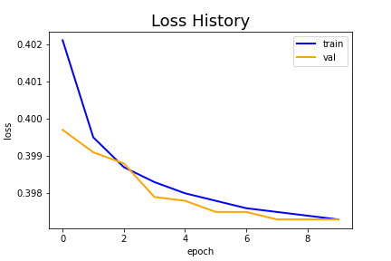
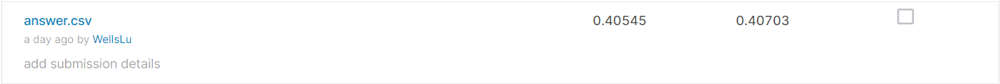

# merkle-interview
CTR predict: https://www.kaggle.com/c/avazu-ctr-prediction

 

## Model Setting
- Model
  - MLP: 16 -> 128+Relu - > 128+Relu -> 256+Relu -> 256+Relu -> 128+Relu -> 64+Relu -> 1+Sigmoid
- Loss
  - BCEloss
- Hyper parameter
  - epoch: 20
  - batch size: 2048
  - optimizer: Adam
  - learning rate: 0.001
  - StepLR step: 5 gamma: 0.1
 

## Training History and Result
### Loss History and Confusion Matrix

### Submission

