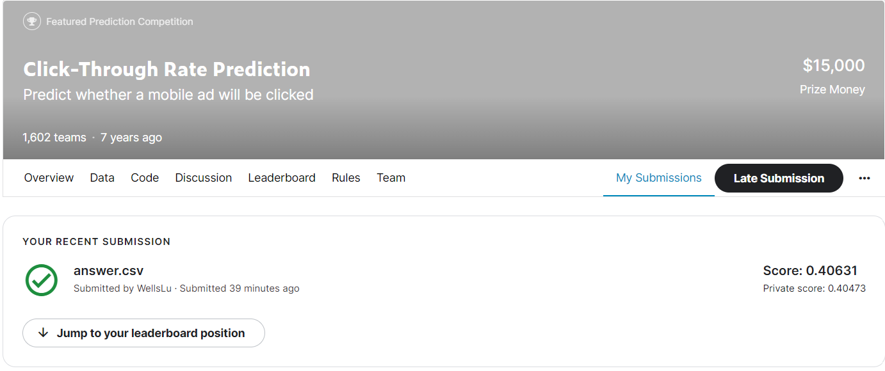

# CTR predict
Kaggle: https://www.kaggle.com/c/avazu-ctr-prediction

 

## Model Setting
- Model
  - MLP: 16 -> 128+Relu - > 128+Relu -> 256+Relu -> 256+Relu -> 128+Relu -> 64+Relu -> 1+Sigmoid
- Loss
  - BCEloss
- Hyper parameter
  - epoch: 20
  - batch size: 2048
  - optimizer: Adam
  - learning rate: 0.001
  - StepLR step: 5 gamma: 0.1
 

## Training History and Result
### Loss History and Confusion Matrix
</img>
</img>
### Submission

 

## 問題
### 1. 探索資料分析
第一個我先看有無空值，確定無空值後我在看click 1:0的數量，大約落在1:5左右，接著再以長條圖的方式看各個column裡的每一個value分布的概況，可以發現某些欄位大部分都集中在某一個value或頻率前擠得values。另外在後面時有發現test data某些欄位有一些value是在train data沒有的。
### 2. 特徵工程
在feature enigeering上我processing了數次，這邊大約可以以階段性整理出5次
 

1、由於所有欄位我皆看作class type，所以我將每個column做label encoding，但有些value出現的次數非常少，所以我依照往常經驗將出現次數低於總數的0.005%也就是約20萬筆資料的value歸類在同一類，考慮到我對每一個欄位所代表的意義不慎了解，所以我選擇用deep learning的方式做到feature extract的效果。此方法最終loss若在0.65左右，效果不彰，於是轉為考慮到是否餵進來的data在encode後不具備實現此預測的意義。
 

2、參考某些人公開的preprocessing方式後，我使用一種比較直白的方式做processing，我將value的總量大於10的column把column內每個值換算成造成click的機率，在以總體平均點擊率往上下加減0.02和0.04分成5個類別，其他總量小於10的column做label encoding，大部分的data也確實會落在總體平均點擊率往上下加減0.04之間，另外時間部份我只取小時，以每兩個小時分為一類。此方法最終loss若在0.48左右，小果有明顯差異，此時我有對模型一些參數作微調(問題3)，但差距不會太大。
 

3、承上述，大多的data會落在總體平均點擊率往上下加減0.04之間，但有些column明顯在0.04之外占了絕大部分，於是我改將data分成11類，分別改成上下加減0.01、0.03、...、0.09。此方法最終loss若在0.47左右，有些微進步但不明顯。
 

4、這時我考慮到上兩次我在training的過程中，training loss和 valudation loss(未經train)都會降到0.31左右，但在testing data裡卻會飄到0.48，training過程中沒有overfitting但結果卻差很大，於是想到是在EDA時有發現的，testing data某些column的value在training data沒有，而且可能這些column影響很大，於是我計算這些沒出現過的value佔testing data的幾%，若超過testing data總量的1%，我就移除該column，此方法最終loss若在0.405左右，training過程中loss也是落在0.39左右，有明顯進步，為了想辦法進到0.4內，我有按這基礎上進行參數調整(問題3)，但仍無法到0.4內。
 

5、最後我承方法4對label encodeing的column做onehot encoding，主要是使維度拉長看看是否能用這些columns在更高維的空間中找到更好的結果，但幾次結果仍在0.406左右。
### 3. 模型調整
模型參數調整上我的epoch有調小batch size有調大過，由於資料筆數足夠多backward的次數也足夠多，所以很快就可以收斂了故為了節省時間把epoch調小野把batch size設大一點
 

learning rate的部分Adam跟StepLR已經會自動更新learning rate的大小，training的過程中也沒有無法收斂或造成梯度消失或爆炸，所以這邊我就不多做調整
 

model部分我使用MLP，layer之間我採用類似encoder-decoder的概念由小拉長再縮小，training過程中也沒有出現overfitting的現象，於是我有增厚layer觀看其變化，但效果沒什麼明顯變化也沒有因此增加training loss和 valudation loss之間的差距
### 4. 思考細節
feature enigeering 和fine tune思考的邏輯都寫在2、3題裡了，最後礙於時間問題，我認為我若能了解2-4方法裡被剔除的6個columns的意義並將它們發揮到它們應有的效果，那testing loss很有機會降到0.38左右(考慮到training loss訓練時大約降至0.3左右但testing data有出現許多未出現過的value造成的差距)
